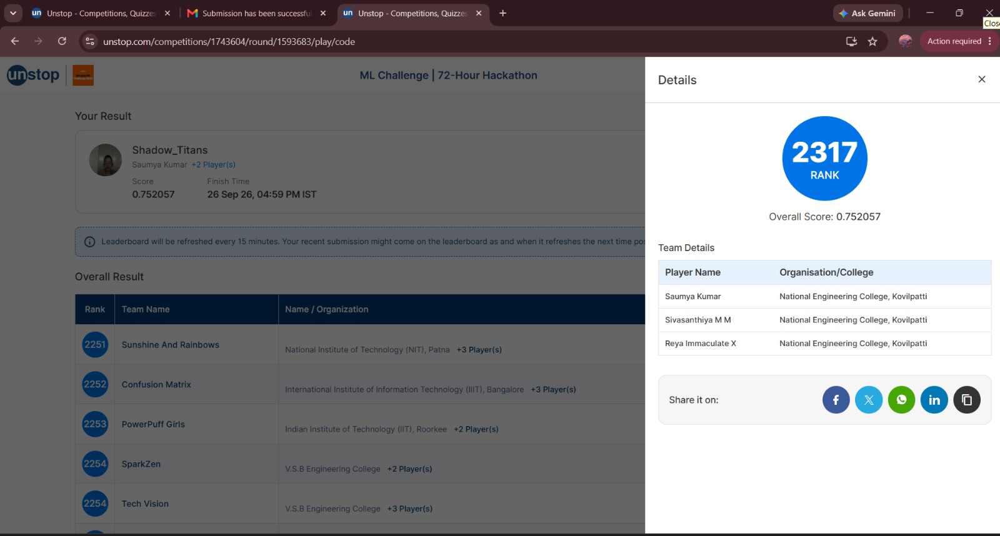

# Our Experience — Amazon ML Challenge 2026

## 🏆 Team Shadow Titans

**Team Members:** Sivasanthiya, Saumya, Reya Immaculate

**Challenge:** Amazon ML Challenge 2026
**Problem:** Business Entity Resolution
**Final Rank:** **2,317 / ~90,000 participants**

## Our Journey

Participating in the Amazon ML Challenge 2026 was a great learning experience for our team. The challenge involved matching business entities across multiple data sources despite differences in names, addresses, languages, spellings, and legal entity formats.

What initially looked like a simple matching problem turned into a large-scale machine learning and information retrieval problem. With millions of records, comparing every possible pair was not practical, so we had to think carefully about how to reduce the search space while still retaining genuine matches.

As a team, we explored different approaches and gradually developed a hybrid solution combining:

* Multilingual text normalization and transliteration
* Multi-pass candidate blocking
* Handcrafted lexical and structural features
* Multilingual E5 embeddings
* LightGBM classification
* Threshold calibration for the Macro-F0.5 metric

One of the most valuable parts of the experience was experimenting with different combinations of features. Our experiments showed us that embeddings alone were not enough for this problem. Combining semantic embeddings with carefully designed domain-specific features produced our strongest validation results.

Our final validation results were:

| Metric                    |     Result |
| ------------------------- | ---------: |
| Macro-F0.5                | **0.9615** |
| Precision                 | **97.45%** |
| Recall                    | **91.18%** |
| Candidate Blocking Recall | **>99.1%** |

We also successfully validated the final submission for all **1,732,544 S1 entities**, receiving a `PASS` from the submission validator.

---

## 🏅 Competition Result

Our final competition ranking was:

**#2,317 among approximately 90,000 participants**

This was a memorable result for our team and gave us confidence that the techniques we developed could handle a challenging large-scale entity-resolution problem.

### Rank Screenshot

*Our final Amazon ML Challenge 2026 ranking.*

---

## What We Learned

This challenge helped us gain practical experience in:

* Large-scale data processing
* Entity resolution and record linkage
* Multilingual NLP
* Candidate generation and blocking
* Feature engineering
* Embeddings and semantic similarity
* Gradient boosting
* Model evaluation and calibration
* Team-based problem solving

More importantly, we learned that building a good ML solution is an iterative process. The final result came from trying different ideas, analyzing their results, learning from unsuccessful approaches, and combining the techniques that worked best.

**Sivasanthiya • Saumya • Reya Immaculate**
